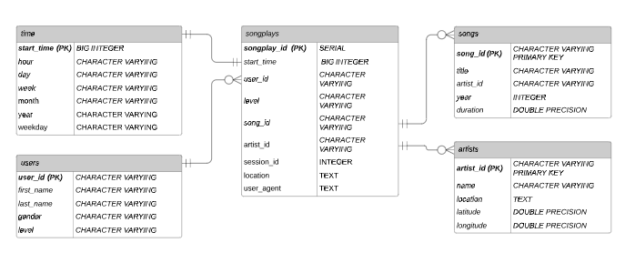

# Project 2: Redshift Star-Schema Database

### Project Introduction:

In this project, data was taken from two sources hosted on S3 AWS servers of varying file quantities and combined together in a star-schema modeled database in order to organize the data to be used in queries needed to analyze said data by the start-up company Sparkify.

In order to put their data to good use in tasks such as analyzation for popular music trends, song recommendation playlists and targeting users for subscription promotions, the conceptual music streaming compay Sparkify needed to gather the the data that it had stored in .json files, reorganize it and move it a Postgres Database for easier querying.

When organizing the records in the tables of the database, a star-schema model was chosen. This basic layout that promotes easy analzation of customer log data especially when the data can broken into different categorically descriptive sets where category can be associated with a central most-often utilized dataset called a fact table. The categorical data - or dimensial data - can then be used to offer supplimental information or detail regarded the centralized dataset.

This type of schema fit the situation well since playlist activity of the app users was logged in the fact table and information about each song play could be queried from the associated dimension tables. In this way analists can quickly scan the fact table for relavant song trends, subscription level and even browser usage - then easily gain access to associated relevant information by joining to the dimension tables. The image below showcases this schema in a ER Diagram.




### Steps:

The steps to create database were as followed:

1) The required tables were created in the star schema. <br>
2) A ETL took copied the .json data from the S3 buckets on a foreign AWS server in "staging tables".
3) Insert the data from the staging tables into their final format in the star schema table system. <br>


### To Instatiate the Database:

After editing the configuration file to with the required information. To create tables and perform ETL run the following scripts in a terminal:

```
>> python create_table.py
>> python etl.py

```

### Files in the repository:

* create_table.py
* etl.py
* sql_queries.py
* download.png

create_tables.py creates the star-schema tables in your redshift database and etl.py moves the data over to them from an S3 bucket.

<br>
<br>
